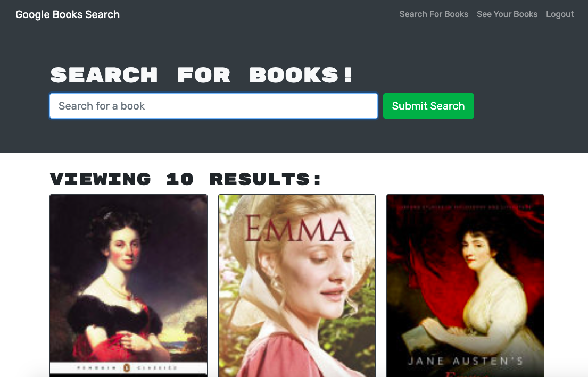

# Book Search

## Purpose
The application provides a user-friendly way to search for books and save them to a reading list. Users can create an account and use Google's book search to find books they want to read. It provides users with information about the book such as description and authors. The books can be saved to an easily accessable list. You'll never lose your reading list again!

## Built With

- React
- Express.js
- MongoDB
- Mongoose
- Apollo server
- GraphQL
- Deployed using Heroku

## Deployed Application

https://nameless-retreat-17902.herokuapp.com/

## Contributions

Made by: Cat 2021